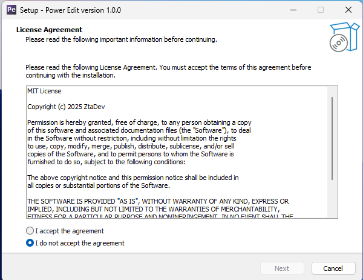

<<<<<<< HEAD
# How to Install PowerEdit

Installing PowerEdit is very simple! Just follow the steps below and you’ll have it up and running in no time.

## Installation Steps:

1. **Download the latest version**
   - Visit the project repository and download the latest release from this link: [🔗 Releases](https://github.com/ZtaMDev/PowerEdit/releases/).

2. **Run the installer**
   - Open the file `PowerEdit-Setup.exe`.

   > **Note:** If a SmartScreen warning appears saying the file should not be run, click **“More info”** and then **“Run anyway”**.  
   > Don’t worry, it’s not a virus! The source code is available for review on GitHub: [🔗 View Repository](https://github.com/ZtaMDev/PowerEdit).

---

3. **Follow the installation wizard**

   - Accept the terms and conditions then click **Next**, , and proceed with **Install**.
   > If you wish, check the option **"Create desktop icon"** before finishing.
   
    

---

You're all set! PowerEdit will be installed and ready to use.
=======
# How to Install PowerEdit

Installing PowerEdit is very simple! Just follow the steps below and you’ll have it up and running in no time.

## Installation Steps:

1. **Download the latest version**
   - Visit the project repository and download the latest release from this link: [🔗 Releases](https://github.com/ZtaMDev/PowerEdit/releases/).

2. **Run the installer**
   - Open the file `PowerEdit-Setup.exe`.

   > **Note:** If a SmartScreen warning appears saying the file should not be run, click **“More info”** and then **“Run anyway”**.  
   > Don’t worry, it’s not a virus! The source code is available for review on GitHub: [🔗 View Repository](https://github.com/ZtaMDev/PowerEdit).

---

3. **Follow the installation wizard**

   - Accept the terms and conditions then click **Next**, , and proceed with **Install**.
   > If you wish, check the option **"Create desktop icon"** before finishing.
   
    

---

You're all set! PowerEdit will be installed and ready to use.
>>>>>>> 5471d78f84d835960d3edf2bd64037c96dfe080a
