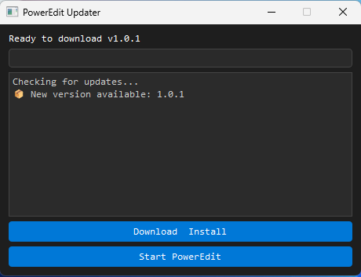

<<<<<<< HEAD
# Update Manager

PowerEdit includes a built-in update manager that automatically checks for the latest releases on GitHub, downloads them, and installs them for you.

## How it works and how to use it

- The update manager always launches before the editor itself.  
  > _(Note: This is why PowerEdit may take a little longer to open. In the future, an option will be added to disable the update manager by default.)_

- When executed, it checks the GitHub releases of PowerEdit and compares the current version with the latest one based on the release tags.

- If a new version is available, the update manager UI is launched.

---

## Step-by-step process:

- **Initial prompt**  
   - The first window will ask whether you want to update.  
   > Updates may introduce bugs or other considerations, so choose wisely.

   - If you select **Yes**, the update process continues.
   - If you select **No**, PowerEdit will launch without updating.

	

---

- **Update interface**  
   If you choose to update, you will see two buttons:
   - `Download Install`
   - `Start PowerEdit`

   - To update, simply click **Download Instal**.
   - The installer for the new version will be downloaded and automatically launched.

	

---

- **Installing the update**  
   The installer is similar to previous versions but contains the latest features and changes.
	   
   > If you’re not familiar with the installation process, refer to the [Getting Started](../installation//getting_started.md) section for a complete guide.

---

## Summary

The update manager ensures you always have the latest features, bug fixes, and improvements—effortlessly.

=======
# Update Manager

PowerEdit includes a built-in update manager that automatically checks for the latest releases on GitHub, downloads them, and installs them for you.

## How it works and how to use it

- The update manager always launches before the editor itself.  
  > _(Note: This is why PowerEdit may take a little longer to open. In the future, an option will be added to disable the update manager by default.)_

- When executed, it checks the GitHub releases of PowerEdit and compares the current version with the latest one based on the release tags.

- If a new version is available, the update manager UI is launched.

---

## Step-by-step process:

- **Initial prompt**  
   - The first window will ask whether you want to update.  
   > Updates may introduce bugs or other considerations, so choose wisely.

   - If you select **Yes**, the update process continues.
   - If you select **No**, PowerEdit will launch without updating.

	

---

- **Update interface**  
   If you choose to update, you will see two buttons:
   - `Download Install`
   - `Start PowerEdit`

   - To update, simply click **Download Instal**.
   - The installer for the new version will be downloaded and automatically launched.

	

---

- **Installing the update**  
   The installer is similar to previous versions but contains the latest features and changes.
	   
   > If you’re not familiar with the installation process, refer to the [Getting Started](../getting_started/) section for a complete guide.

---

## Summary

The update manager ensures you always have the latest features, bug fixes, and improvements—effortlessly.

>>>>>>> 5471d78f84d835960d3edf2bd64037c96dfe080a
