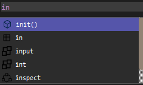

# Autocompletion

The **autocompletion** feature is a standard element in code editors, and PowerEdit includes its own implementation to help you write code faster and more accurately.

## How It Works

The autocompletion system works by extracting keywords and values from the installed `.extend` files. These files define language-specific data and are selected based on the active file type and syntax mode.

> **Note:** Autocompletion in PowerEdit is still under development and has some limitations. It does **not** currently suggest words based on context, and it does **not** trigger correctly when typing next to characters like `<`,  `>`,  `;`,  `=`,  or  `:`.

Each recognized value type is paired with a small icon to help differentiate it. The system currently supports the following value types:

### Supported Categories

| Type         | Description                                      | Example(s)                | Icon(s)            |
|--------------|--------------------------------------------------|---------------------------|--------------------|
| `extensions` | File types associated with the syntax            | `.py`, `.html`, `.css`    | None
| `keywords`   | Language-specific keywords                       | `def`, `if`, `return`     | 

|
| `builtins`   | Built-in functions or methods                    | `abs()`, `format()`       |

|
| `modules`    | Standard or third-party libraries                | `os`, `sys`, `math`       |

|
| `types`      | Data or syntax types                             | `int`, `float`, `str`     |

|
| `values`     | Common values (e.g. in CSS)                      | `5px`, `auto`, `block`    |

|
| `color_names`| Color values recognized by the syntax (CSS)      | `white`, `red`, `blue`    | None
| `functions`  | Functions dynamically detected in your own code  | `my_function()`, etc.     |

> **Note:** In future updates, you will be able to define your own autocomplete entries for external modules, improving support for libraries and frameworks.

## Source of Suggestions

All suggestions come from:
- The currently selected language
- The active file type (e.g., `.py`, `.html`, `.css`)
- The `.extend` file associated with that language

→ [Learn more about `.extend` files and how to define autocomplete values](../extend/getting_started.md)

---