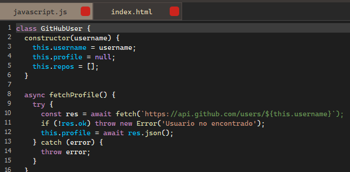

# Editor

The **Editor** is the core component of PowerEdit, designed with the essential features of a modern code editor. It includes a clean **text input area**, **line numbers**, and a **scrollbar** on the right side for easy navigation.

> **Note:** A **minimap scroll** is currently under development and not yet fully functional. You can try enabling it by editing the source code [here in the GitHub repository](https://github.com/ZtaMDev/PowerEdit), and feel free to contribute to the project to help improve the experience for all users.

## Features

### File Display
The editor displays the contents of any file opened from the  
- [File Explorer](file-explorer.md), or  
- [File Menu](top-menu.md#file-menu).

### Tab System
PowerEdit uses a **tabbed interface** that allows you to open multiple files simultaneously—just like any modern code editor.

- All open tabs and editor state are preserved when exiting the application.
- The **last active tab** is also saved and automatically reopened the next time you launch PowerEdit.

> ⚠️ **Warning:** If you close the editor without saving, any unsaved changes to the code **will be lost**. Be sure to save your work!

### Layout System
The editor supports a **layout system**, which allows you to rearrange certain widgets like the file explorer and (in future updates) additional panels.

This layout flexibility pairs perfectly with the **Live Preview** feature, making it ideal for editing HTML, CSS, JS, or any other kind of web-based content.

→ [Learn more about Live Preview](live-preview.md)

---