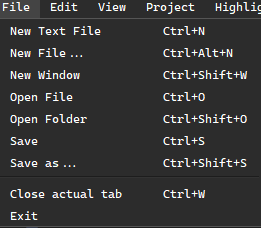
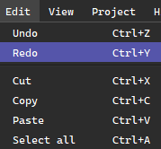
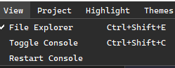
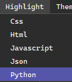
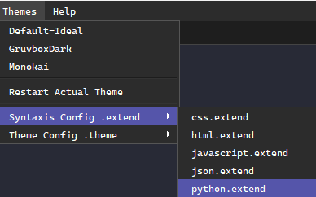

# Top Menu

The **Top Menu** is an essential part of the PowerEdit interface. It allows users to control all major functionalities of the editor through a series of well-organized options.

Most of these options have keyboard shortcuts assigned for quicker access and efficiency.

> **Note:** In a future update, PowerEdit will include customizable shortcut mappings, allowing users to remap editor shortcuts as they prefer.

## File Menu

The **File** menu contains the most important options for managing files and projects within PowerEdit. This menu gives you control over creating, opening, and saving files, as well as managing your workspace.

Each menu option has a specific purpose and is organized into the following categories:

- **New Text File** (`Ctrl+N`)  
  Creates a blank text file with no extension.

- **New File** (`Ctrl+Alt+N`)  
  Creates a new file with a programming-related extension.  
  > *Note: This option ensures that syntax highlighting is applied automatically based on the file extension.*

- **New Window** (`Ctrl+Shift+W`)  
  Opens a fresh instance of the editor.  
  > ⚠️ **Warning:** This will close the current project, discard unsaved changes, and reset open tabs, the file explorer, and the console. Be sure to save your work before using this option.

- **Open File** (`Ctrl+O`)  
  Opens an existing file in a new tab.

- **Open Folder** (`Ctrl+Shift+O`)  
  Opens a folder and displays its structure in the file explorer.  
  > *Note: This will reset the file explorer and reopen it at the selected path.*

- **Save** (`Ctrl+S`)  
  Saves the current file.

- **Save As** (`Ctrl+Shift+S`)  
  Saves the current file under a new name or in a different location.

- **Close Current Tab** (`Ctrl+W`)  
  Closes the currently selected tab.  
  > *Note: Only the active tab will be closed; other tabs remain open.*

- **Exit**  
  Closes the application.

## Edit Menu

The **Edit** menu provides essential tools for modifying content within the editor. Although most of these options are commonly used via their keyboard shortcuts, they are also accessible through the top menu.

These are standard editing commands found in most code editors:

- **Undo** (`Ctrl+Z`)  
  Reverts the last change made in the editor.

- **Redo** (`Ctrl+Y`)  
  Re-applies the last undone action.

- **Cut** (`Ctrl+X`)  
  Removes the selected text and copies it to the clipboard.

- **Copy** (`Ctrl+C`)  
  Copies the selected text to the clipboard.

- **Paste** (`Ctrl+V`)  
  Inserts the content from the clipboard at the current cursor position.

- **Select All** (`Ctrl+A`)  
  Selects all text in the current document.

> These shortcuts follow the classic behavior found in most operating systems and editors.

## View Menu

The **View** menu provides options to show, hide, or manage some of the editor's key interface elements. These options allow users to toggle visibility and control the behavior of various widgets such as the file explorer and the integrated console.

- **Toggle File Explorer** (`Ctrl+Shift+E`)  
  Shows or hides the file explorer panel on the left side of the editor.

- **Toggle Console** (`Ctrl+Shift+C`)  
  Shows or hides the integrated terminal at the bottom of the interface.

- **Restart Console**  
  Restarts the integrated terminal.  
  > *Note: The console will restart in the current project’s root directory. If no project is open, it will default to the user's Documents folder.*

## Project Menu

> **Note:** The Project menu currently has limited functionality, but here is a full explanation of its use.

The **Project** menu contains a single key option: selecting the **root folder** (`Ctrl+Shift+R`) of your project. This root directory becomes the reference point for several core components of PowerEdit:

- The integrated **console** will operate from this directory.
- The **file explorer** will open and list contents starting from this path.
- The **Live Preview** system will use this root as the base for file indexing and rendering.  
  → [Learn more about Live Preview](live-preview.md)

Selecting the root folder helps maintain a unified project context across all tools inside the editor.

## Highlight Menu

The **Highlight** menu allows you to manually set the syntax highlighting for the currently active tab.

Its main purpose is to assign the appropriate syntax rules to a file, especially when the file does not have a recognized extension or when automatic detection is not desired.

Only supported file types will be available in this menu. These types are determined by their extensions or by definitions included via `.extend` files.

→ [Learn more about `.extend` files and custom syntax definitions](../extend/getting_started.md)

## Themes Menu

The **Themes** menu allows you to select and manage the themes installed in the `themes` folder of the application. This includes both the default themes and any custom themes you have added.

- **Select a Theme**  
  All themes currently located in the `themes` directory will be automatically recognized and displayed in the menu. You can switch between them instantly.

- **Open Theme Configuration**  
  Opens the selected theme file for editing, allowing you to customize its colors, styles, and layout.

- **Edit `.extend` Files**  
  This option allows you to open and modify installed `.extend` files, which define additional syntax rules for new languages or tags.

> The system will automatically detect `.extend` files placed inside the program’s `extend` directory.

To learn how to create your own `.theme` and `.extend` files, refer to the following pages:  
→ [How to Create Custom Themes](../theme/getting_started.md)  
→ [Creating and Using `.extend` Syntax Files](../extend/getting_started.md)

## Help Menu

The **Help** menu provides quick access to useful information and integrated tools for users.

- **About PowerEdit**  
  Displays information about the current version of the editor, authorship, and license.

- **Download Source Code**  
  Offers a fast and intuitive way to download the current project or source files directly from within the editor.

→ [Learn more about how source code download works](download-source.md)
